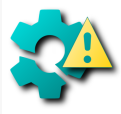

### Hi there 👋

I'm Irfan.

- ### My projects?

<table>
    <td>&nbsp;&nbsp;&nbsp;&nbsp;&nbsp;&nbsp;<a href="https://github.com/mirfatif/PermissionManagerX"> PMX</a>&nbsp;&nbsp;&nbsp;&nbsp;&nbsp;&nbsp;</td>
    <td>&nbsp;&nbsp;&nbsp;&nbsp;&nbsp;&nbsp;<a href="https://github.com/mirfatif/NoorUlHuda"> NUH</a>&nbsp;&nbsp;&nbsp;&nbsp;&nbsp;&nbsp;</td>
    <td>&nbsp;<a href="https://github.com/mirfatif/MyLocation"> MyLocation</a></td>
    <td><a href="https://github.com/mirfatif/WhatsRunning"> WhatsRunning</a></td>
    <td><a href="https://github.com/mirfatif/Fyrypt"> Fyrypt</a></td>
</table>

- ### What else I do?

<table>
    <td>&nbsp;&nbsp;<a href="https://android.stackexchange.com/users/218526"> AndroidSE</a>&nbsp;</td>
    <td>&nbsp;&nbsp;&nbsp;&nbsp;&nbsp;&nbsp;&nbsp;<a href="https://forum.xda-developers.com/m/mirfatif.7805402"> XDA</a>&nbsp;&nbsp;&nbsp;&nbsp;&nbsp;&nbsp;&nbsp;</td>
    <td>&nbsp;&nbsp;&nbsp;<a href="https://play.google.com/store/apps/developer?id=Irfan+Latif"> PlayStore</a>&nbsp;&nbsp;</td>
</table>

- ### Want to reach me?

<table>
    <td>&nbsp;&nbsp;&nbsp;<a href="https://t.me/mirfatif" width="500"> Telegram</a>&nbsp;&nbsp;&nbsp;</td>
    <td>&nbsp;&nbsp;&nbsp;&nbsp;&nbsp;&nbsp;<a href="mailto:mirfatif.dev@gmail.com"> Email</a>&nbsp;&nbsp;&nbsp;&nbsp;&nbsp;&nbsp;</td>
</table>

- ### Want to support my work?

<table>
    <td>&nbsp;&nbsp;&nbsp;&nbsp;&nbsp;&nbsp;<a href="https://www.buymeacoffee.com/mirfatif"> BMC</a>&nbsp;&nbsp;&nbsp;&nbsp;&nbsp;&nbsp;&nbsp;</td>
    <td>&nbsp;&nbsp;&nbsp;&nbsp;<a href="http://mirfatif.github.io/mirfatif/bitcoin_redirect"> Bitcoin</a>&nbsp;&nbsp;&nbsp;&nbsp;&nbsp;</td>
</table>

  (`bitcoin:18ijfsv5fcDKQ6CTe4wycKxZMmti4oUXjW`)

